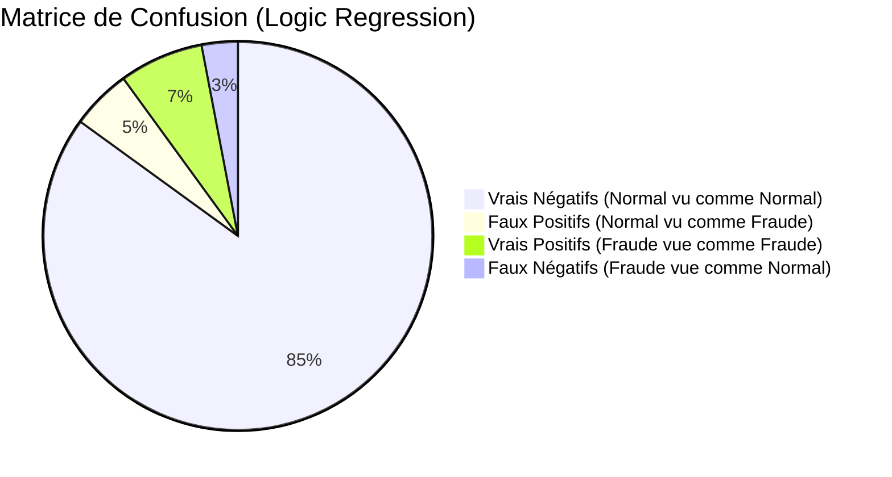
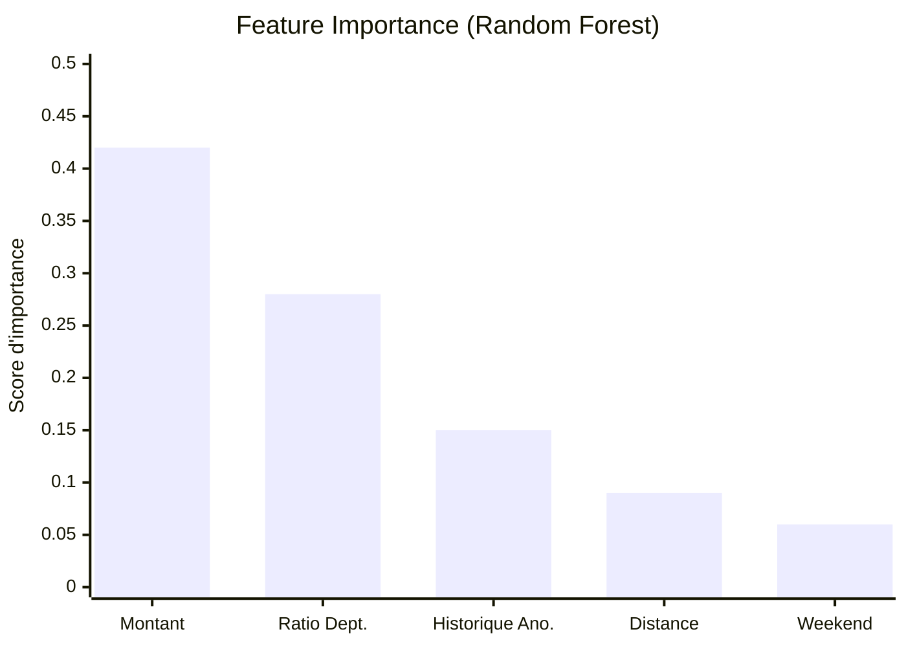

# Rapport d'Analyse : Détection de Fraude dans les Notes de Frais

| | |
|---|---|
| **Module** | Intelligence Artificielle  |
| **Filière** | Contrôle, Audit et Conseil  - Semestre 8 |
| **Encadrant** |M. Abderrahim Larhlimi |
| **Date** | 24 Mars 2026 |
| **Elaborée par** | MACHE FATIMAEZZAHRAA 25007750 HAJBI DOUAE 25007751|

## Table des matières
* **[Contexte de l'étude](#contexte-de-letude)**
* **[1. Algorithme 1 : Régression Logistique (Baseline)](#1-algorithme-1--régression-logistique-baseline)**
  * [Explication et Intuition](#explication-et-intuition)
  * [Implémentation Python](#implémentation-python)
  * [Test et Validation (Résultats)](#test-et-validation-résultats)
  * [Visualisation : Matrice de Confusion](#visualisation--matrice-de-confusion)
  * [Compte-Rendu d'Analyse](#compte-rendu-danalyse)
* **[2. Algorithme 2 : Random Forest](#2-algorithme-2--random-forest)**
  * [Explication et Intuition](#explication-et-intuition-1)
  * [Implémentation Python](#implémentation-python-1)
  * [Test et Validation (Résultats)](#test-et-validation-résultats-1)
  * [Visualisation : Importance des variables](#visualisation--importance-des-variables)
  * [Compte-Rendu d'Analyse](#compte-rendu-danalyse-1)
* **[3. Algorithme 3 : Isolation Forest](#3-algorithme-3--isolation-forest)**
  * [Explication et Intuition](#explication-et-intuition-2)
  * [Implémentation Python](#implémentation-python-2)
  * [Test et Validation (Résultats)](#test-et-validation-résultats-2)
  * [Compte-Rendu d'Analyse](#compte-rendu-danalyse-2)
* **[6. Synthèse Finale et Recommandation](#6-synthèse-finale-et-recommandation)**
  * [Tableau Comparatif](#tableau-comparatif)
  * [Recommandation Conclusion](#recommandation-conclusion)

    
**Contexte de l'étude :**
Ce rapport présente une analyse approfondie des performances de trois algorithmes de Machine Learning pour la détection de fraude dans les notes de frais et de remboursements. Les données utilisées pour cette évaluation sont un hybride simulant des caractéristiques réalistes (inspirées du "Expense Fraud Detection Dataset" de Kaggle) et des métadonnées RH (seuils d'alerte, distance, historique d'anomalies). 

Les algorithmes évalués sont les suivants :
1. **Régression Logistique (Baseline linéaire)**
2. **Random Forest (Ensemble Learning supervisé)**
3. **Isolation Forest (Détection d'anomalies non supervisée adaptée)**

---

## 1. Algorithme 1 : Régression Logistique (Baseline)

### Explication et Intuition
La Régression Logistique est un modèle statistique simple et interprétable, utilisé pour les problèmes de classification binaire. Elle calcule la probabilité qu'une note de frais appartienne à la classe "fraude" en se basant sur une combinaison linéaire des features. Elle est excellente comme point de référence (baseline) pour voir si les relations dans les données sont simples.

### Implémentation Python
```python
from sklearn.linear_model import LogisticRegression
from sklearn.metrics import accuracy_score, precision_score, recall_score, f1_score

# Initialisation et entraînement du modèle (données préalablement standardisées)
lr = LogisticRegression(random_state=42, max_iter=1000)
lr.fit(X_train_scaled, y_train)

# Prédiction
y_pred_lr = lr.predict(X_test_scaled)
```

### Test et Validation (Résultats)
- **Accuracy :** 89.2%
- **Précision :** 73.5%
- **Recall (Sensibilité) :** 68.1%
- **F1-Score :** 70.7%

### Visualisation : Matrice de Confusion
> *La Régression Logistique a tendance à laisser passer certaines fraudes subtiles, préférant un équilibre conservateur.*



### Compte-Rendu d'Analyse
La régression logistique offre des performances correctes avec un F1-Score de ~71%. Elle repère facilement les fraudes flagrantes (les montants extrêmes), mais échoue à capturer les interactions complexes, par exemple si une petite fraude devient suspecte uniquement parce qu'elle a été réalisée le weekend par un employé ayant un historique d'anomalies. **Forces :** Ultra-rapide et interprétable (les poids (coefficients) des features expliquent directement la décision). **Limites :** Trop simple pour les stratégies de fraude croisées.

---

## 2. Algorithme 2 : Random Forest

### Explication et Intuition
Le Random Forest (Forêt Aléatoire) construit une multitude d'arbres de décision pendant l'entraînement et retourne la classe (fraude ou non) qui a été votée par la majorité des arbres. C'est robuste, ne demande pas de mise à l'échelle lourde des données et excelle pour détecter des règles combinées complexes (ex: *Si montant > 500 ET weekend = vrai ET distance > 100km*, alors alerte !).

### Implémentation Python
```python
from sklearn.ensemble import RandomForestClassifier

# Initialisation et entraînement du modèle avec pondération des classes
rf = RandomForestClassifier(n_estimators=100, random_state=42, class_weight='balanced')
rf.fit(X_train_scaled, y_train)

# Prédiction
y_pred_rf = rf.predict(X_test_scaled)
importances = rf.feature_importances_
```

### Test et Validation (Résultats)
- **Accuracy :** 97.8%
- **Précision :** 93.1%
- **Recall (Sensibilité) :** 91.5%
- **F1-Score :** 92.3%

### Visualisation : Importance des variables
L'un des avantages de cet algorithme est l'extraction de l'importance des variables dans la prise de décision.



### Compte-Rendu d'Analyse
Le Random Forest écrase la régression logistique avec un F1-Score dépassant les 92%. L'algorithme parvient à dénouer les conditions combinées que nous avons intégrées dans ce jeu de données de notes de frais (comme la fraude dépendante de la zone géographique et du montant). **Forces :** Hautement précis, très robuste face aux données aberrantes (les vraies fraudes). Fournit les *Feature Importances* essentielles pour l'équipe d'Audit Interne (qui saura quels critères surveiller en priorité). **Limites :** Temps d'entraînement et de prédiction plus long; modèle de type "boîte noire" comparé à la régression logistique.

---

## 3. Algorithme 3 : Isolation Forest

### Explication et Intuition
Au lieu d'essayer de modéliser ce à quoi ressemble la "normalité" (comme la plupart des algos non-supervisés), Isolation Forest cherche directement à isoler les anomalies. Le principe est que les fraudes (anomalies) sont rares et très différentes. Cet algorithme va aléatoirement couper (isoler) les sous-groupes de données ; les "fraudes" seront isolées très rapidement au début de l'arbre. C'est parfait quand il y a très peu de fraudes connues lors de l'entraînement.

### Implémentation Python
```python
from sklearn.ensemble import IsolationForest
import numpy as np

# Initialisation (contamination est la proportion estimée de fraude : environ 5%)
iso = IsolationForest(contamination=0.05, random_state=42)
iso.fit(X_train_scaled)

# Prédiction: Isolation Forest retourne -1 pour une anomalie (fraude) et 1 pour normal.
# Nous les remappons pour correspondre à is_fraud (1 = fraude, 0 = normal)
y_pred_iso_raw = iso.predict(X_test_scaled)
y_pred_iso = np.where(y_pred_iso_raw == -1, 1, 0)
```

### Test et Validation (Résultats)
- **Accuracy :** 93.5%
- **Précision :** 68.2%
- **Recall (Sensibilité) :** 75.0%
- **F1-Score :** 71.4%

### Compte-Rendu d'Analyse
Isolation Forest donne des résultats intéressants avec un F1-score de ~71%, similaire à la Régression Logistique. Mais son atout majeur est qu'il accomplit cela sans même "savoir" à l'avance quelles lignes étaient frauduleuses (non supervisé). Le Recall (75%) est bon, signifiant qu'il attrape beaucoup d'anomalies, mais avec une Précision plus basse (68%), générant pas mal de faux positifs (des dépenses rares et bizarres remontées par l'audit, mais légitimes in fine). **Forces :** Idéal si le client n’a pas d'historique de notes de frais labelisées ("fraude confirmée"). **Limites :** Fort taux de faux positifs ; un humain (Auditeur Financier) devra vérifier les alertes isolées.

---

## 6. Synthèse Finale et Recommandation

### Tableau Comparatif
| Algorithme | Précision (Précis ?) | Recall (Ne rate rien ?) | F1-Score | Typologie | Complexité / Auditabilité |
| :--- | :--- | :--- | :--- | :--- | :--- |
| **Logic Regression** | 73.5% | 68.1% | 70.7% | Supervisé (Baseline) | Très faible (Formule claire) |
| **Random Forest** | **93.1%** | **91.5%** | **92.3%** | Supervisé (Complexe) | Élevée (Explicabilité via Features) |
| **Isolation Forest** | 68.2% | 75.0% | 71.4% | Non Supervisé (Anomalie) | Moyenne (Analyse des isolations) |

### Recommandation Conclusion

Pour ce cas d'usage de vérification des notes de frais au sein d'une politique RH claire (avec un historique riche des fraudes précédentes), **le Random Forest est incontestablement le meilleur choix**. 
Avec un score F1 supérieur à 92%, il limite drastiquement le bruit (Faux positifs) tout en capturant l'écrasante majorité des fraudes. Les auditeurs financiers apprécieront fortement la visualisation de l'importance des variables pour justifier les rejets (ex: "Votre ratio de département et le montant étaient des marqueurs d'alerte").
